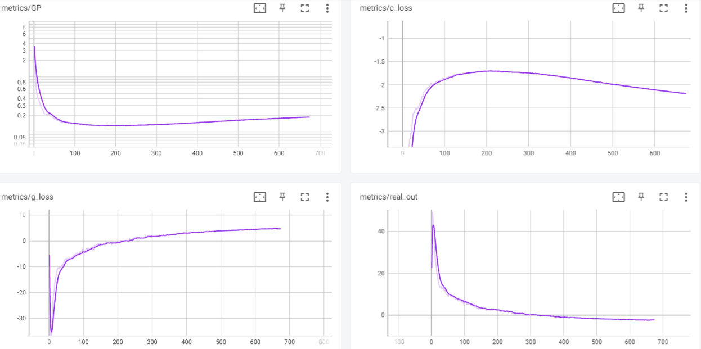

# CIFAR-10 cWGAN-GP in TensorFlow
This repository contains an educational implementation of a Conditional Wasserstein Generative Adversarial Network with Gradient Penalty (cWGAN-GP) for the CIFAR-10 dataset using the TensorFlow library. The primary purpose of this project is to provide a learning resource for understanding GANs and their application in image generation.

## Repository Structure

- `datatools.py`: Utility scripts for loading and preprocessing data from the CIFAR-10 dataset.

- `model.py`: Class and functions to build the GAN model.

- `train.py`: Logic for training the GAN model, including data loading, model creation, and training process.

## Training Process
Here is the GAN training process using an animated GIF:  
  
*Airplane, Automobile, Bird, Cat, Deer, Dog, Frog, Horse, Ship, Truck*  

Training metrics in Tensorboard: 

Where:  
*g_loss = -fake_output*  
*c_loss = fake_output -real_output + GP*

## License
This project is licensed under the [MIT License](LICENSE).